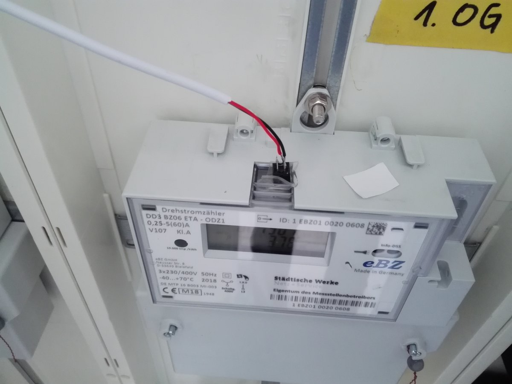
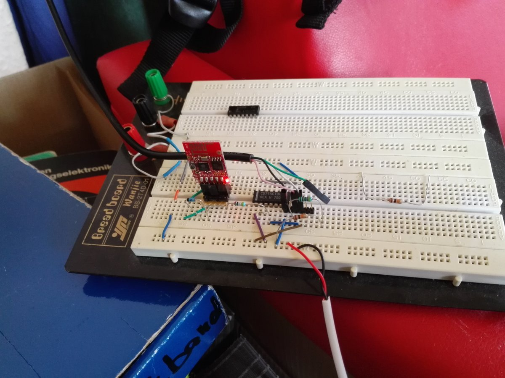
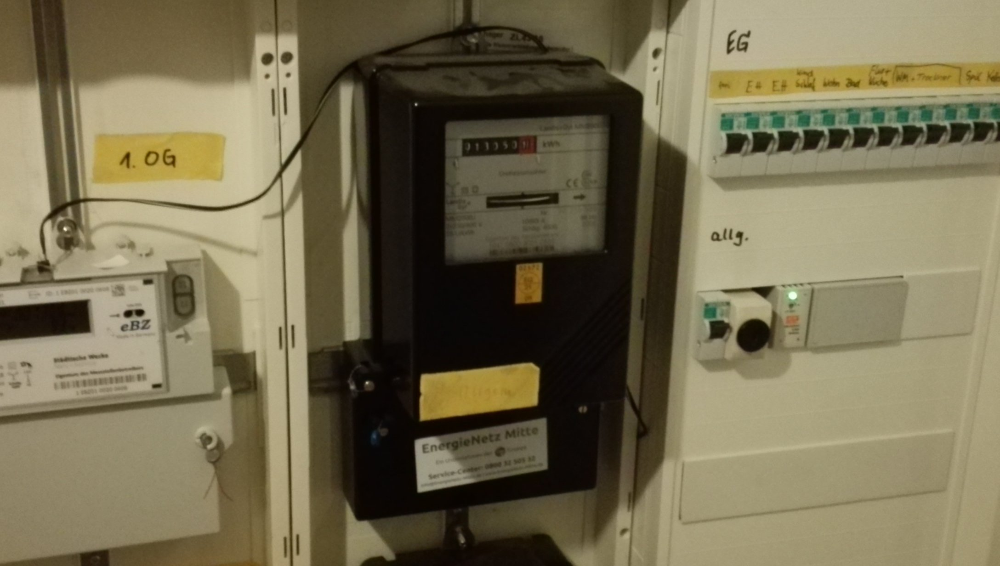
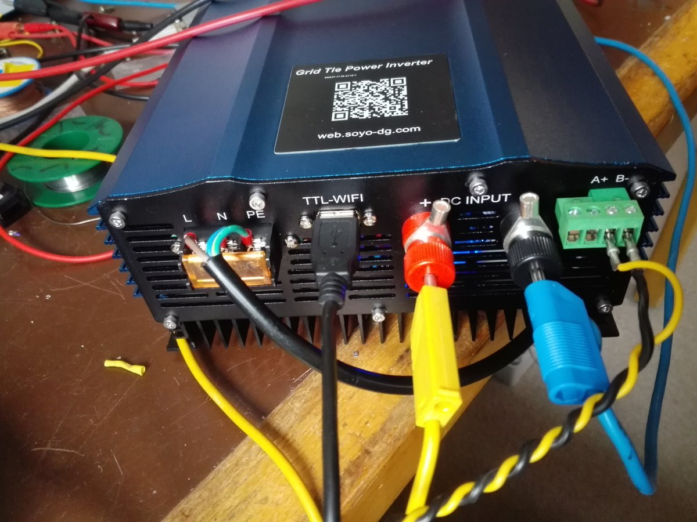
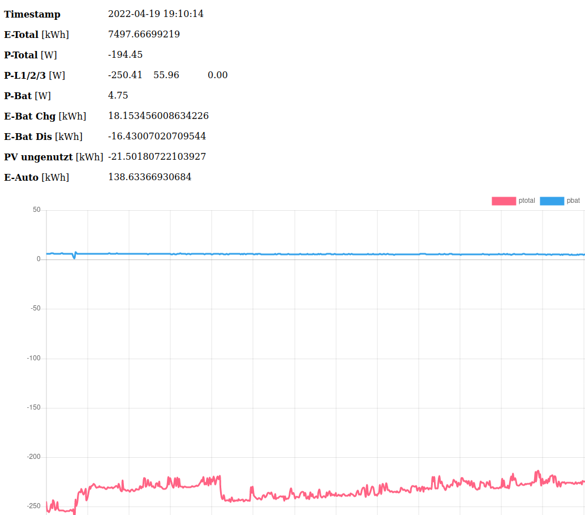

This project intends to maximize the energy usage from your solar array by storing unused energy in a battery.
To minimize hardware effort it uses the existing energy meter that is provided by your network operator.

# Reading the energy flow
This project builds upon the common eBZ meter that is commonly found in Germany. Similar techniques apply to other meters.
These meters provide an infrared port that sends out a serial data stream periodically. Many meters have an "info" and an "MSB" port, the latter sends out more information. But the info port can also be programmed to send out more information by entering a password, provided by your network operator.

Most of all we are interested in total momentary power, anything else is optional. The eBZ meter outputs power in a 1 second interval. When taking energy from the grid power is positive, when putting it back into the grid it reads negative.

We read the serial datastream with a CNY70 combined phototransistor and IR diode. The latter remains unused though, it's just what I had in my parts bin. It is glued on top of the MSB interface with transparent tape, obviously:

We then pass the signal to some signal conditioning circuitry. The circuit is supplied by 5V and consists of a 15k pull-up resistor (it took some scoping to find the best value), a 74ACT04 inverter TTL chip (because parts bin), a 470 ohm series resistor, a voltage limiting diode towards 3.3V, a 3.3V linear LDO, and finally an ESP8266 wifi module, doesn't really matter which flavour.

So the data stream passes through two of the 74ACT04 inverter stages (you could use a non-inverting driver in the first place), through the 470 Ohm series resistor to the RX pin of the ESP8266.

I put everything into a DIN rail enclosure and use a 5V DIN rail power supply to run it (The one with the green LED)

Finally you need to flash some software onto the ESP8266 that is found in the esp8266-egy-counter directory. Many tutorials out there how to achieve that with Arduino. Then set it up to connect to your local Wifi hotspot.

The ESP module provides its own web interface for debugging

Most of all though it sends JSON encoded counter data via MQTT to a hard-coded MQTT broker. Please change this to reflect your setup. I send it to topic /ebz/readings which all other scripts rely on. A typical blob looks like this

    {"id":"1EBZ0100200608","etotal":7497.66699219,"ptotal":-57.16,"pphase":[-127.46,70.30,0.00]}
    
So finally we need to setup some low power Linux computer that runs most of the remaining software. I use a BeagleBone that comes with Debian Linux. All scripts are python, a weird mix of python 2 and 3. You need python-serial and paho-mqtt for Python. Also the mosquitto MQTT broker. That is pretty much it. I have it located near my Ethernet switch to not have to rely on a wifi connection.

# Charging the battery
Now lets look into how we can put energy into our battery. I use an NMC battery that is well balanced and that I decided to run without BMS. That is not a brilliant idea and I don't recommend it and plan to change it. But somehow I have to explain the lack of any BMS communication in the scripts later. The battery has an easy SoC curve, it is 50.2V when full and about 40V when empty. By leaving some margin to these extremes I get away without the BMS.

Ok, charging, finally. I use a Manson HCS-3604 switch mode power supply, rated 60V, 15A. You can use any switch mode supply you can get ahold of as long as it provides the correct voltage and sufficient power AND can be controlled externally.

The Manson supply has a USB interface that runs a simple serial protocol. Manson even supplies a python libary for easier access. It is included in this repository and I have extended it slightly.

The manson_charger.py script basically interfaces the supply via MQTT. In topic /charger/setpoint/voltage and /charger/setpoint/power it receives its output commands. In /charger/info/+ it supplies various readings. The voltage setpoint ensures that we do not over-charge the battery - as long as all cells are equal!

UPDATE: I have replaced the Manson supply with an Eltek Flatpack 3 kW power supply that I had lying around anyway. It communicates via CAN and has a fallback mode where output voltage falls to 43.5V when no commands are received.

When /charger/setpoint/power is not published two over 2s power is set to 0W by the python script. When the script crashes the charger will keep charging  only limited by the constant voltage setpoint.

So that's it, intelligence comes further down.

# Discharging the battery
Now of course at some point we want to get that energy back out from the battery and run our appliances with it. And that's what we need an inverter for. I use a Soyosource GTN1200 that can supply 900W AC. It also comes with various power levels and voltages, so pick an appropriate one for your battery. The GTN series is universal and can be used with PV cells and batteries. It comes configured for PV operation which needs to be changed. There is also some mimimum cutoff voltage which is a nice backup to our software logic.

It has an RS-485 interface that is normally connected to their own power sensing gadget but we interface via our python script. In addition it has a second serial port that is meant for a Wifi module. It looks like a USB port but is actually 5V, TX, RX, GND. I use this second interface for READING values because the RS485 port does not output any data on my device. It is a known bug.

Therefor in script soyosource_inverter.py you will find two serial ports being used. Similar to the charger it receives a power setpoint on topic /inverter/setpoint/power and returns some data in /inverter/info

When /inverter/setpoint/power is not published for over 5s power is set to 0 by the device. When the script crashes power is also set to 0.

# Tying it all together
Finally script netzero.py makes sense of it all. It is "clocked" by the incoming messages from the power meter. If the meter reports energy going into the grid the script will ramp up the charger until no energy goes to the grid anymore. Likewise when energy is taken from the grid it will ramp up the inverter until no energy is taken from the grid anymore - within the inverters power limit of course.

It also exports battery power in topic /battery/power . Negative when taking energy from the battery, otherwise positive.

Inverter power is also governed by battery voltage. Power is ramped down to 0 as a given target is approached. Adjust the limits in config.json

Since this storage system is AC coupled it can work with as many solar arrays as you like. For example I have 2 solar arrays and the battery can be charged from both. We loose some energy to conversion losses this way but are more flexible also in where we can put the storage system. It actually lives in my desk:

# Cloudy stuff
If you run a web server with a database you can deploy some simple php scripts provided in the server-side directory. index.php contains commands to set up your database. You probably want to play with display.php to show what you want.
Python script submitToLogger.py sends the data to your web server via https. Set the web server URI in config.json. I use a static key for minimalistic access control that is sent along with the data every time. The server only stores a hash of that key. Please set this up in config.inc.php
The script sends the counter data from above and merges battery power into the JSON blob as well.

# Disclaimer
As always things I present are somewhat dangerous and you repeat them at your own risk. In terms of safety the system has some shortcomings
- It is located in the living area in a wooden desk
- There is no BMS that throttles charging when one cell goes out of check
- There is no temperature surveillance of the battery

Things you want to think about and that I will change in the future as well.

Apart from that: happy solar energy usage maximization!
